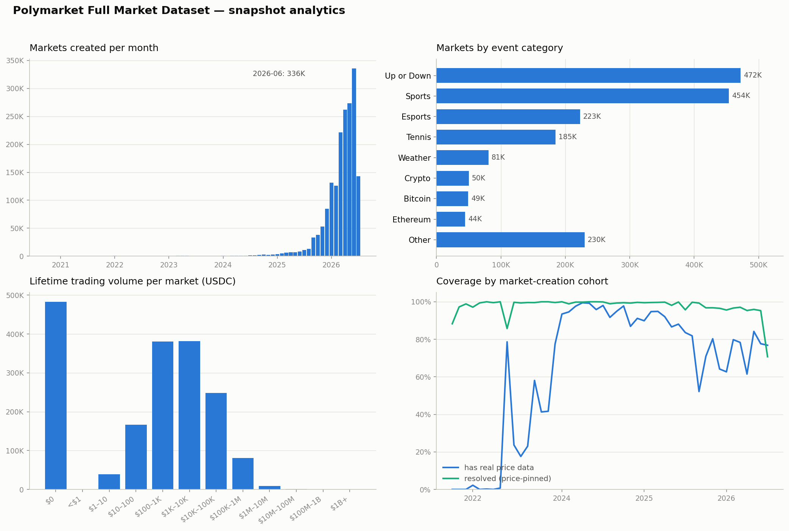

# Polymarket Full Market Dataset

A **complete, point-in-time archive of Polymarket**: every event and market served by
Polymarket's public Gamma API — from the platform's launch in 2020 through the snapshot
date — with final resolution outcomes, full metadata (questions, rules, tags, timing,
order-book flags), and **dense daily OHLC price candles for every outcome token**,
assembled from the CLOB price-history API.

One snapshot = one self-contained JSON file. One row = one market, with its event
context, resolution, and complete daily price series embedded.

## At a glance (snapshot `2026_07_12_235011`)

| | |
|---|---|
| Market rows | **1,788,703** |
| Distinct events | 679,884 |
| Markets with candle series | **1,787,257 (99.92%)** |
| Embedded daily candle rows | 38,263,931 |
| Markets with a derived resolution | 1,715,580 (95.9%) |
| Time span | 2020-10-02 → 2026-07-12 (snapshot date) |
| File size | 44.9 GB (uncompressed JSON) |
| Schema | `polymarket_market_export_v2` |

Every snapshot ships with a `.summary.json` (same header metadata + one example row)
and machine-readable coverage reports (`polymarket_daily_candles_status.json`, etc.).



**Reading the four panels:** (1) market creation exploded in 2026 — driven by
high-frequency recurring series (hourly/5-minute crypto up-or-down, sports); the
peak month alone added 336K markets. (2) Those series dominate the category mix
("Up or Down" + Sports + Esports + Tennis ≈ 75% of all markets). (3) Volume is
bimodal: ~484K markets never traded ($0), while the traded bulk clusters at
$100–$10K lifetime volume and 65 markets exceed $100M. (4) Coverage by creation
cohort — this panel counts **real trade prices** (non-null closes), a stricter
bar than having a candle series (99.9% of markets have one): pre-2023 cohorts
have few real prices because CLOB price history doesn't exist for that era
(structural, not a collection gap), and the 60–85% band in 2025–26 cohorts
reflects ultra-short markets (5-minute/hourly series) whose lifetime is below
the daily price-history fidelity. The resolution-rate drop in the newest cohort
is simply markets that are still open.

## How this snapshot was verified

Coverage claims are audited, not assumed. For this snapshot:

- **Events — exact:** the archive's event ids were diffed against a *full enumeration*
  of Gamma's closed-events and open-events keyset feeds (670k+ closed, ~9.7k open).
  Missing: **zero**. (14 events exist here that Polymarket has since deleted upstream —
  retained deliberately; this is an archive.)
- **Markets — sampled exact:** 2,498 randomly sampled events (over-weighted toward
  recently created ones) were re-fetched live from Gamma and every listed child market
  checked against the archive: **0 missing of 6,698**, 0 closed-flag mismatches,
  0 missing outcome prices.
- **Candles — internal audit:** 0 duplicate `(token, interval, day)` keys across
  partitions; **99.92% of markets carry a complete dense daily series and 100% of
  3.55M tokens have daily rows**; 99.99+% of closed markets carry outcome prices.
  (This required repairing a systematic upstream quirk: retroactively-listed
  markets carry `start_time > end_time` in Gamma metadata and were invisible to
  the standard backfill — their histories were recovered via window-independent
  fetches.)
- **File-level:** the shipped JSON is re-parsed end-to-end after export; header
  `row_count`/`markets_with_candles` must match streamed reality exactly; ids must be
  unique; row ordering must match the declared `row_ordering`. A 348-row sample was
  additionally compared against the live API (zero regressions).

## File format

Each snapshot is a single JSON object, laid out so that you never need to load 44 GB
at once:

```
{
  "dataset_name": "polymarket_full_market_dataset",
  "row_schema_version": "polymarket_market_export_v2",
  "generated_at": "...",
  "row_count": 1788703,
  "markets_with_candles": 1757791,
  "row_ordering": {...},
  "row_shape": {...},          ← full machine-readable schema
  "rows": [
    {...one COMPACT market object per line...},
    {...}
  ]
}
```

The header is pretty-printed; **each element of `rows` is exactly one line**. The
fast path is line-oriented — no streaming-JSON library required:

```python
import json

def iter_markets(path):
    with open(path, "rb") as f:
        in_rows = False
        for line in f:
            s = line.strip()
            if not in_rows:
                if s == b'"rows": [':
                    in_rows = True
                continue
            if s in (b"]", b"],", b"}"):
                continue
            yield json.loads(s.rstrip(b","))

for row in iter_markets("polymarket_full_market_dataset_2026_07_12_172952.json"):
    ...
```

Rows are ordered by model-facing `times.open_time` ascending (nulls last), then
`market_created_time`, then `market_id` — a coarse chronological pass over markets.

## Row schema

Each row contains these blocks (full field-level types in the header's `row_shape`):

| Block | Contents |
|---|---|
| `ids` | `market_id` (Gamma integer id), `condition_id` (0x… CLOB hash), `event_id`, `clob_token_ids` (one ERC-1155 token id per outcome) |
| `question` / `question_sources` | canonical question text and every source it was derived from (market title, event title, memory case) |
| `rules` | primary rules text, market/event descriptions, resolution source URL, resolver address |
| `resolution` | derived outcome: `winner_index` / `winner_label` / `winner_yes`, `resolution_method`, `resolution_time`, UMA status fields, `strict_settlement_yes` |
| `outcomes` | outcome labels, count, `is_binary`, latest prices per outcome |
| `times` | every timestamp: market/event created/start/end/updated, `close_time`, and the model-facing `open_time` used for ordering |
| `market` | title, slug, descriptions, `active`/`closed` flags, volumes, `raw_meta` extras (best bid/ask, closed time, automation flags) |
| `event` | parent event: title, slug, category, `tags` (full Gamma tag objects), series id, `raw_meta` (ticker, images) |
| `trade_metrics` | volume aggregates (total/24h/1wk/1mo/1yr, AMM vs CLOB), spread, best bid/ask, last trade price |
| `order_book` | order-book capability flags (accepting orders, funded, ready, restricted, RFQ) |
| `market_closing_rules` | close/end timing details, UMA end date, liveness, activation flags |
| `market_memory` | enrichment from the research pipeline's memory store — question/rules snapshot, category, entity tokens, baseline probability, price-trace stats. **Only present for a ~47k-market research subset** (see caveats) |
| `candles` | the full dense daily price series (see below) |
| `candle_summary` | count, empty-row count, intervals present, latest candle, volume stats |
| `availability` | `has_candles`, `has_resolution`, `has_market_memory_case` — flags for quick filtering |

### Resolutions

Polymarket has no separate "resolutions" API; outcomes are encoded in final prices.
The `resolution` block is derived at export time:

- **`price_extreme`** (94% of resolved rows): some outcome's final price pinned to
  ≥ 0.999 (winner) — the normal on-chain settlement signature.
- **`deterministic_winner`** (~2%): market closed/resolved without pinned prices;
  the max-price outcome is taken, with YES/NO tie-breaking. Treat as slightly weaker
  evidence (includes 50-50 voids).
- `strict_settlement_yes` is a conservatively-derived boolean settlement label,
  present only for the memory-case subset.

Markets that are still open (or closed without usable prices) have
`availability.has_resolution = false`.

### Candles — read this before using the price series

Dense daily candles (`period_interval_minutes = 1440`) target **one row per CLOB
token per UTC day** across the market's listing window, built from the CLOB
`prices-history` endpoint:

- Multi-outcome markets have one series **per outcome token**, interleaved in
  `candles` (group by `token_id`; each token's series is time-ordered).
- Days with trades carry real OHLC (`close` = probability in [0,1] for that outcome).
- Days without trades are **synthetic**: either carry-forward of the last close
  (`raw_meta.carry_forward = true`) or fully empty placeholders
  (`raw_meta.empty = true`, `empty_reason = "no_prior_trade"`). This is by design —
  the series is dense so that day-indexed joins work — but it means you must check
  `raw_meta` before treating a candle as a market observation.
- A small set of markets additionally carries finer close-window candles
  (`period_interval_minutes` ∈ {15, 60}) near market close.
- `volume`/`liquidity` are usually null at daily fidelity (the endpoint returns
  prices only).

Strict full-window coverage (every token, every expected day) is tracked in
`polymarket_daily_candles_status.json`; markets can be metadata-complete but
candle-sparse — filter with `availability.has_candles` and `candle_summary`.

## Examples

**A binary recurring crypto market** (the highest-frequency market family on
Polymarket — hourly/5-minute up-or-down series):

```json
{
  "ids": {"market_id": 2603340, "event_id": 610611,
          "condition_id": "0xc19b389c49ce4bc0d5e266273890ede2e55c159d6a20b5abdc984d7fb4579600",
          "clob_token_ids": ["34004…7473", "18197…0081"]},
  "question": "Bitcoin Up or Down - June 21, 12AM ET",
  "event": {"title": "Bitcoin Up or Down - June 21, 12AM ET", "category": "Crypto",
            "slug": "bitcoin-up-or-down-june-21-2026-12am-et"},
  "outcomes": {"is_binary": true, "labels": ["Up", "Down"], "latest_prices": [0.0, 1.0]},
  "resolution": {"winner_index": 1, "winner_label": "Down", "winner_yes": false,
                 "resolution_method": "price_extreme",
                 "resolution_source": "https://www.binance.com/en/trade/BTC_USDT",
                 "resolution_time": "2026-06-21T05:00:00+00:00",
                 "uma_resolution_status": "resolved"},
  "times": {"open_time": "2026-06-19T04:01:59+00:00", "close_time": "2026-06-21T05:00:00+00:00"},
  "market": {"closed": true, "volume": 32553.71},
  "candle_summary": {"count": 6, "empty_candle_count": 2, "interval_minutes_present": [1440]},
  "candles": [
    {"token_id": "18197…0081", "outcome": "Down",
     "end_period_ts": "2026-06-19T23:59:59.999999+00:00",
     "open": null, "close": null,
     "raw_meta": {"empty": true, "empty_reason": "no_prior_trade",
                  "source": "polymarket_prices_history_dense_daily"}},
    {"token_id": "18197…0081", "outcome": "Down",
     "end_period_ts": "2026-06-20T23:59:59.999999+00:00",
     "open": 0.5, "high": 0.5, "low": 0.5, "close": 0.5, "raw_meta": {"…": "…"}},
    "… one row per token per day …"
  ],
  "availability": {"has_candles": true, "has_resolution": true, "has_market_memory_case": false}
}
```

Note the two tokens (Up/Down): each gets its own daily series; the pre-listing day is
an empty placeholder; the resolution (`Down`, `price_extreme`) matches
`latest_prices` `[0.0, 1.0]`.

**A categorical sports market** — same shape, non-YES/NO labels:

```json
{
  "ids": {"market_id": 2603415, "event_id": 610636},
  "question": "Dallas Wings vs. Connecticut Sun",
  "event": {"category": "Sports", "slug": "wnba-dal-conn-2026-07-02"},
  "outcomes": {"labels": ["Dallas Wings", "Connecticut Sun"], "latest_prices": [1.0, 0.0]},
  "resolution": {"winner_index": 0, "winner_label": "Dallas Wings", "winner_yes": true,
                 "resolution_method": "price_extreme",
                 "resolution_source": "https://www.wnba.com/scores"},
  "market": {"closed": true, "volume": 170961.86},
  "candle_summary": {"count": 30, "empty_candle_count": 2}
}
```

Two weeks of daily prices per team-token; the winning token's final close pins to ~1.0.

## Usage recipes

**All resolved markets in a window, as lightweight JSONL:**

```python
out = open("resolved_2026H1.jsonl", "w")
for row in iter_markets(SNAPSHOT):
    res, times = row["resolution"], row["times"]
    if res.get("winner_index") is None:
        continue
    t = res.get("resolution_time") or times.get("close_time") or ""
    if "2026-01-01" <= t < "2026-07-01":
        out.write(json.dumps({
            "market_id": row["ids"]["market_id"],
            "question": row["question"],
            "labels": row["outcomes"]["labels"],
            "winner": res["winner_label"],
            "close_time": times["close_time"],
            "volume": row["market"]["volume"],
        }) + "\n")
```

**A per-day probability panel for one market:**

```python
from collections import defaultdict
series = defaultdict(dict)
for c in row["candles"]:
    if c["period_interval_minutes"] != 1440 or c["close"] is None:
        continue
    day = c["end_period_ts"][:10]
    series[c["outcome"]][day] = float(c["close"])
```

**⚠️ Leakage warning:** this is *one row per market including the final resolution*.
For training forecasters, never show a model fields computed after your decision
time (`resolution`, `outcomes.latest_prices`, final candles, `market.closed`,
volumes-at-close…). For leakage-aware supervised splits, prefer a temporal panel
built from the candles, or the upstream `export_polymarket_temporal_panel.py`.

## Caveats and known limitations

- **1,377 rows have `condition_id: null`** — early pre-CLOB / draft markets; they
  also lack tokens and candles. Metadata-only.
- **`market_memory` covers only ~47k markets** (a research-pipeline subset built in
  March 2026). `availability.has_market_memory_case` flags it; all other enrichment
  is present for every row.
- **Synthetic candle rows** (empty / carry-forward) are part of the dense series by
  design — check `raw_meta`.
- **No tick data.** Candles are the only price history; Polymarket does not serve
  historical ticks, and a server outage May 6 → Jul 11 2026 makes sub-daily data for
  that window unrecoverable.
- **A dense series is not the same as real trade data.** 99.9% of markets have a
  complete daily series, but for pre-2023 listings (no CLOB history exists for
  that era) and many ultra-short 2025–26 markets (lifetime below daily fidelity)
  the series is entirely placeholder rows. Filter on `close IS NOT NULL` /
  `candle_summary.empty_candle_count` when you need actual prices.
- **Snapshots accumulate** in this repo; use `latest` pointers/README to find the
  newest. Older snapshots are kept for reproducibility.
- **Deleted-upstream events are retained** (14 as of this snapshot).

## Provenance

Snapshots are exported from a PostgreSQL archive continuously ingested from
Polymarket's public APIs (`gamma-api.polymarket.com` for events/markets/metadata,
`clob.polymarket.com/prices-history` for candles). All writes are idempotent
upserts keyed on Gamma ids; resolution fields refresh whenever a closed market is
re-observed. The archive → export path is a single `REPEATABLE READ` transaction,
so header counts and rows are mutually consistent.

## Snapshot history

| Snapshot | Rows | With candles | Candle rows | Size |
|---|---|---|---|---|
| `2026_07_12_235011` | 1,788,703 | **1,787,257** | 38,263,931 | 44.9 GB |
| `2026_07_12_172952` | 1,788,703 | 1,757,791 | 37,699,627 | 44.6 GB |
| `2026_05_01_221213` | 1,004,540 | 982,741 | 24,239,343 | 25.2 GB |
| `2026_04_30_215103` | 1,004,540 | 470,775 | 11,279,708 | 17 GB |
| earlier April snapshots | 1,004,540 | partial | — | 4.9–15 GB |

Data © Polymarket, collected from public APIs; provided for research use.
